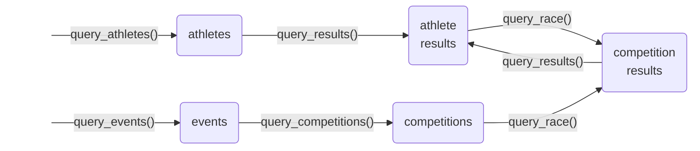

<!-- README.md is generated from README.Rmd. Please edit that file -->

```{r, include = FALSE}
knitr::opts_chunk$set(
  collapse = TRUE,
  comment = "#>",
  fig.path = "man/figures/README-",
  out.width = "100%"
)
```

# fisdata 

<!-- badges: start -->
[](https://github.com/stibu81/fisdata/actions/workflows/R-CMD-check.yaml)
[](https://app.codecov.io/gh/stibu81/fisdata)
<!-- badges: end -->

fisdata makes it easy to download data from the 
[FIS webpage](https://www.fis-ski.com) into tibbles.


## Installation

You can install the development version of fisdata from
[GitHub](https://github.com/) with:

``` r
# install.packages("remotes")
remotes::install_github("stibu81/fisdata")
```

## Terminology

In order to use the functionality of this package and understand the results
it returns, it is important to be familiar with its terminology. It follows
mostly the terminology used on the FIS page. Other than the web page, it uses
terms consistently and never uses the same term for different things.

The following are the relevant terms with an example value for each.
Explanations for terms with obvious meaning are omitted.


| Term        | Explanation                                      | Examples      |
|-------------|--------------------------------------------------|---------------|
| athlete     |                                                  | Didier Cuche, Lara Gut-Behrami  |
| sector      | the major groups of disciplines                  | Alpine Skiing, Cross-Country |
| discipline  | a specific discipline                            | Downhill, Large Hill, Aerials   |
| brand       | manufacturer of an athlete's skis or snowboards | Stöckli, Head |
| competition | a competition in a single discipline and sector | Wengen Downhill 2025 |
| event       | a set of one or more competitions in one or more disciplines taking place during one or more days in a specific location during a season | Wengen 2025 | category    | type of the event                                 | World Cup, Olympic Winter Games |

When filtering for sector, discipline, or category, a code is used instead of
the full description. See the datasets `sectors`, `disciplines`, and 
`categories`, respectively, for a list of available codes with a description.


## Available Querying Functions

fisdata currently offers four functions to query different types of data:

* `query_athletes()`: query athletes by name and other attributes and obtain
  a table of matching athletes.
* `query_results()`: query all competition results for a single athlete.
* `query_race()`: get the full results for a single competition.
* `query_events()`: query events by date, place, and other attributes.
* `query_competitions()`: obtain all individual competitions that are
  associated with an event.
  
  
Each function returns a tibble that contains instances of a given type as its
rows. The following diagram shows the types of tables that can be created.
Each node stands for a table with the label of the node indicating the type
of objects contained in the table. Each arrow is labelled by the name of the
function that returns the table that the arrow is pointing to. Some functions
require an instance of another type as input, as indicated by the arrows.
The two exceptions, `query_athletes()` and `query_events()` are thus the usual
entry points to start a query.




## Running a Query

Since athletes are identified by a Competitor-ID and races by a Race-ID
that are usually not known to the user, it is generally easiest to start a
query by finding an athlete. For example, the following call gets the
information for Didier Cuche:

```{r message=FALSE}
library(fisdata)
library(dplyr)

cuche <- query_athletes("cuche", "didier")
cuche %>% 
  select(active:nation, sector, brand, competitor_id)
```

The result includes the `competitor_id`, which is required as input in order
to query an athlete's results.

With the object returned by `query_athletes()`, it is now possible to query
all the race result of an athlete. Note that `query_results()` must be called
with a single athlete. The following query only obtains the results in
downhill races:

```{r}
cuche_res <- query_results(cuche, discipline = "DH")
cuche_res %>% 
  select(athlete:place, category:rank, race_id)
```

The result includes the `race_id`, which is required as input in order
to query the full results of a race.

By extracting one of the races from the table, one can now obtain the full
results for that race. The following code gets the full result for Didier
Cuche's last victory in Wengen:

```{r}
wengen_res <- cuche_res %>% 
  filter(place == "Wengen", rank == 1) %>% 
  head(n = 1) %>%
  query_race()
wengen_res %>% 
  select(rank, bib, name:diff_time)
```

Alternatively, you may start by querying for an event. This finds the
Wengen races from the season 2024/25:

```{r}
wengen2025 <- query_events(sector = "AL", place = "wengen", season = 2025)
wengen2025 %>% 
  select(start_date:genders)
```

The result includes the `event_id`, which is required as input in order
to query all the competitions that took place during this event:

```{r}
wengen_races <- query_competitions(wengen2025)
wengen_races %>% 
  select(place:cancelled)
```

This table now allows to query for the full race results (similar to the output
from `query_results()`). For example, the results for the Super G can be
obtained as follows:

```{r}
sg_res <- wengen_races %>% 
  filter(competition == "Super G") %>% 
  query_race()
sg_res %>% 
  select(rank, bib, name:diff_time)
```

Note that the objects created by the querying functions always include the
URL that was downloaded. This URL can be obtained as follows:

```{r}
show_url(cuche_res)
```

You can copy this address into a browser in order to see the same data as
they are presented on the FIS web site. To make this as easy as possible,
`show_url()` automatically copies the URL into the clip board, when called
from an interactive R session.


## Known Limitations

Querying athletes and results is expected to work for all sectors and
disciplines. Querying races, however, is more difficult, since different types
of races have their results rendered in different form on the FIS web site.
fisdata is able to handle the results of many common types of races but it is
expected to fail for some types that are not yet covered. For example,
it usually cannot handle team races:

```{r error=TRUE}
query_athletes("von allmen", "franjo") %>% 
  query_results(category = "WSC") %>% 
  filter(discipline == "Team Combined") %>% 
  query_race()
```


