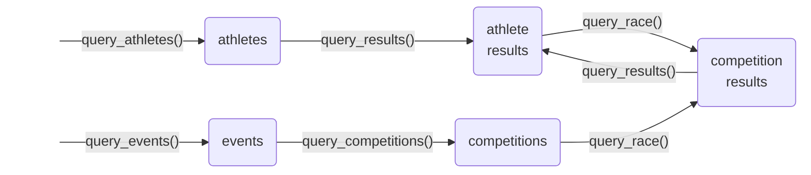

<!-- README.md is generated from README.Rmd. Please edit that file -->

# fisdata 

<!-- badges: start -->

[](https://github.com/stibu81/fisdata/actions/workflows/R-CMD-check.yaml)
[](https://app.codecov.io/gh/stibu81/fisdata)
<!-- badges: end -->

fisdata makes it easy to download data from the [FIS
webpage](https://www.fis-ski.com) into tibbles.

## Installation

You can install the development version of fisdata from
[GitHub](https://github.com/) with:

``` r
# install.packages("remotes")
remotes::install_github("stibu81/fisdata")
```

## Terminology

In order to use the functionality of this package and understand the
results it returns, it is important to be familiar with its terminology.
It follows mostly the terminology used on the FIS page. Other than the
web page, it uses terms consistently and never uses the same term for
different things.

The following are the relevant terms with an example value for each.
Explanations for terms with obvious meaning are omitted.

| Term | Explanation | Examples |
|----|----|----|
| athlete |  | Didier Cuche, Lara Gut-Behrami |
| sector | the major groups of disciplines | Alpine Skiing, Cross-Country |
| discipline | a specific discipline | Downhill, Large Hill, Aerials |
| brand | manufacturer of an athlete’s skis or snowboards | Stöckli, Head |
| competition | a competition in a single discipline and sector | Wengen Downhill 2025 |
| event | a set of one or more competitions in one or more disciplines taking place during one or more days in a specific location during a season | Wengen 2025 |

When filtering for sector, discipline, or category, a code is used
instead of the full description. See the datasets `sectors`,
`disciplines`, and `categories`, respectively, for a list of available
codes with a description.

## Available Querying Functions

fisdata currently offers four functions to query different types of
data:

- `query_athletes()`: query athletes by name and other attributes and
  obtain a table of matching athletes.
- `query_results()`: query all competition results for a single athlete.
- `query_race()`: get the full results for a single competition.
- `query_events()`: query events by date, place, and other attributes.
- `query_competitions()`: obtain all individual competitions that are
  associated with an event.

Each function returns a tibble that contains instances of a given type
as its rows. The following diagram shows the types of tables that can be
created. Each node stands for a table with the label of the node
indicating the type of objects contained in the table. Each arrow is
labelled by the name of the function that returns the table that the
arrow is pointing to. Some functions require an instance of another type
as input, as indicated by the arrows. The two exceptions,
`query_athletes()` and `query_events()` are thus the usual entry points
to start a query.



## Running a Query

Since athletes are identified by a Competitor-ID and races by a Race-ID
that are usually not known to the user, it is generally easiest to start
a query by finding an athlete. For example, the following call gets the
information for Didier Cuche:

``` r
library(fisdata)
library(dplyr)

cuche <- query_athletes("cuche", "didier")
cuche %>% 
  select(active:nation, sector, brand, competitor_id)
#> # A tibble: 1 × 7
#>   active fis_code name         nation sector brand competitor_id
#>   <lgl>  <chr>    <chr>        <chr>  <chr>  <chr> <chr>        
#> 1 FALSE  510030   Cuche Didier SUI    AL     Head  11795
```

The result includes the `competitor_id`, which is required as input in
order to query an athlete’s results.

With the object returned by `query_athletes()`, it is now possible to
query all the race result of an athlete. Note that `query_results()`
must be called with a single athlete. The following query only obtains
the results in downhill races:

``` r
cuche_res <- query_results(cuche, discipline = "DH")
cuche_res %>% 
  select(athlete:place, category:rank, race_id)
#> # A tibble: 303 × 7
#>    athlete      date       place      category  discipline  rank race_id
#>    <chr>        <date>     <chr>      <chr>     <chr>      <int> <chr>  
#>  1 Cuche Didier 2012-03-14 Schladming World Cup Downhill      17 66746  
#>  2 Cuche Didier 2012-03-13 Schladming Training  Downhill       1 66744  
#>  3 Cuche Didier 2012-03-03 Kvitfjell  World Cup Downhill      10 66811  
#>  4 Cuche Didier 2012-03-01 Kvitfjell  Training  Downhill       2 66809  
#>  5 Cuche Didier 2012-02-29 Kvitfjell  Training  Downhill       3 66810  
#>  6 Cuche Didier 2012-02-11 Sochi      World Cup Downhill      12 66801  
#>  7 Cuche Didier 2012-02-10 Sochi      Training  Downhill       7 66800  
#>  8 Cuche Didier 2012-02-08 Sochi      Training  Downhill       2 66798  
#>  9 Cuche Didier 2012-02-04 Chamonix   World Cup Downhill       7 66795  
#> 10 Cuche Didier 2012-02-03 Chamonix   World Cup Downhill       3 66767  
#> # ℹ 293 more rows
```

The result includes the `race_id`, which is required as input in order
to query the full results of a race.

By extracting one of the races from the table, one can now obtain the
full results for that race. The following code gets the full result for
Didier Cuche’s last victory in Wengen:

``` r
wengen_res <- cuche_res %>% 
  filter(place == "Wengen", rank == 1) %>% 
  head(n = 1) %>%
  query_race()
wengen_res %>% 
  select(rank, bib, name:diff_time)
#> # A tibble: 70 × 7
#>     rank   bib name                birth_year nation time      diff_time
#>    <int> <int> <chr>                    <int> <chr>  <Period>  <Period> 
#>  1     1    18 Cuche Didier              1974 SUI    1M 50.31S 0S       
#>  2     2    12 Heel Werner               1982 ITA    1M 51.17S 0.86S    
#>  3     3    15 Janka Carlo               1986 SUI    1M 51.52S 1.21S    
#>  4     4     1 Jerman Andrej             1978 SLO    1M 51.58S 1.27S    
#>  5     5     3 Nyman Steven              1982 USA    1M 51.67S 1.36S    
#>  6     6    14 Scheiber Mario            1983 AUT    1M 51.76S 1.45S    
#>  7     7    28 Streitberger Georg        1981 AUT    1M 51.77S 1.46S    
#>  8     8    16 Walchhofer Michael        1975 AUT    1M 51.79S 1.48S    
#>  9     8    11 Kroell Klaus              1980 AUT    1M 51.79S 1.48S    
#> 10    10    25 Innerhofer Christof       1984 ITA    1M 51.85S 1.54S    
#> # ℹ 60 more rows
```

Alternatively, you may start by querying for an event. This finds the
Wengen races from the season 2024/25:

``` r
wengen2025 <- query_events(sector = "AL", place = "wengen", season = 2025)
wengen2025 %>% 
  select(start_date:genders)
#> # A tibble: 1 × 8
#>   start_date end_date   place  nation sector categories disciplines    genders
#>   <date>     <date>     <chr>  <chr>  <chr>  <chr>      <chr>          <chr>  
#> 1 2025-01-14 2025-01-19 Wengen SUI    AL     TRA / WC   4xDH / SL / SG M
```

The result includes the `event_id`, which is required as input in order
to query all the competitions that took place during this event:

``` r
wengen_races <- query_competitions(wengen2025)
wengen_races %>% 
  select(place:cancelled)
#> # A tibble: 6 × 8
#>   place  date       time  competition       sector category gender cancelled
#>   <chr>  <date>     <chr> <chr>             <chr>  <chr>    <chr>  <lgl>    
#> 1 Wengen 2025-01-14 12:30 Downhill Training AL     TRA      M      FALSE    
#> 2 Wengen 2025-01-15 12:30 Downhill Training AL     TRA      M      FALSE    
#> 3 Wengen 2025-01-16 <NA>  Downhill Training AL     TRA      M      TRUE     
#> 4 Wengen 2025-01-17 12:30 Super G           AL     WC       M      FALSE    
#> 5 Wengen 2025-01-18 12:45 Downhill          AL     WC       M      FALSE    
#> 6 Wengen 2025-01-19 10:15 Slalom            AL     WC       M      FALSE
```

This table now allows to query for the full race results (similar to the
output from `query_results()`). For example, the results for the Super G
can be obtained as follows:

``` r
sg_res <- wengen_races %>% 
  filter(competition == "Super G") %>% 
  query_race()
sg_res %>% 
  select(rank, bib, name:diff_time)
#> # A tibble: 47 × 8
#>     rank   bib name               brand    birth_year nation time      diff_time
#>    <int> <int> <chr>              <chr>         <int> <chr>  <Period>  <Period> 
#>  1     1     3 Von Allmen Franjo  Head           2001 SUI    1M 47.65S 0S       
#>  2     2     6 Kriechmayr Vincent Head           1991 AUT    1M 47.75S 0.1S     
#>  3     3    11 Rogentin Stefan    Fischer        1994 SUI    1M 48.23S 0.58S    
#>  4     4     1 Crawford James     Head           1997 CAN    1M 48.27S 0.62S    
#>  5     5     9 Paris Dominik      Nordica        1989 ITA    1M 48.28S 0.63S    
#>  6     6     8 Casse Mattia       Rossign…       1990 ITA    1M 48.57S 0.92S    
#>  7     7    13 Odermatt Marco     Stoeckli       1997 SUI    1M 48.69S 1.04S    
#>  8     8    16 Alexander Cameron  Rossign…       1997 CAN    1M 48.78S 1.13S    
#>  9     9     2 Monney Alexis      Stoeckli       2000 SUI    1M 48.92S 1.27S    
#> 10    10    26 Feurstein Lukas    Head           2001 AUT    1M 48.97S 1.32S    
#> # ℹ 37 more rows
```

Note that the objects created by the querying functions always include
the URL that was downloaded. This URL can be obtained as follows:

``` r
show_url(cuche_res)
#> https://www.fis-ski.com/DB/general/athlete-biography.html?sectorcode=AL&seasoncode=&competitorid=11795&type=result&categorycode=&sort=&place=&disciplinecode=DH&position=&limit=2000
```

You can copy this address into a browser in order to see the same data
as they are presented on the FIS web site. To make this as easy as
possible, `show_url()` automatically copies the URL into the clip board,
when called from an interactive R session.

## Known Limitations

Querying athletes and results is expected to work for all sectors and
disciplines. Querying races, however, is more difficult, since different
types of races have their results rendered in different form on the FIS
web site. fisdata is able to handle the results of many common types of
races but it is expected to fail for some types that are not yet
covered. For example, it usually cannot handle team races:

``` r
query_athletes("von allmen", "franjo") %>% 
  query_results(category = "WSC") %>% 
  filter(discipline == "Team Combined") %>% 
  query_race()
#> Warning in query_race(.): ! The data contains some fields unknown to fisdata.
#> ℹ Affected column: 'name'
#> ! These columns might not be processed as expected.
#> Warning in process_race_column(name, race_df): NAs introduced by coercion
#> Warning in process_race_column(name, race_df): NAs introduced by coercion
#> Warning in process_race_column(name, race_df): NAs introduced by coercion
#> Error in `dplyr::as_tibble()`:
#> ! Column names `nation` and `time` must not be duplicated.
#> Use `.name_repair` to specify repair.
#> Caused by error in `repaired_names()`:
#> ! Names must be unique.
#> ✖ These names are duplicated:
#>   * "nation" at locations 7 and 8.
#>   * "time" at locations 9 and 10.
```
